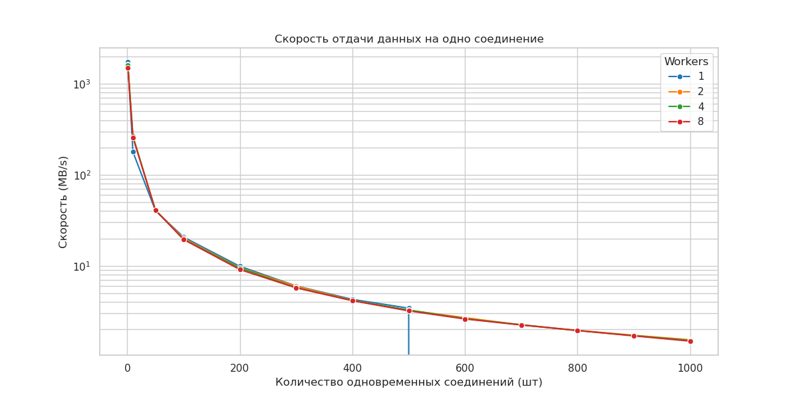

# Курсовая работа по Компьютерным Сетям
## НА ТЕМУ: «Разработка статического HTTP сервера»

Вариант архитектуры разрабатываемого сервера: **prefork + pselect()**

Результаты нагрузочного тестирования

